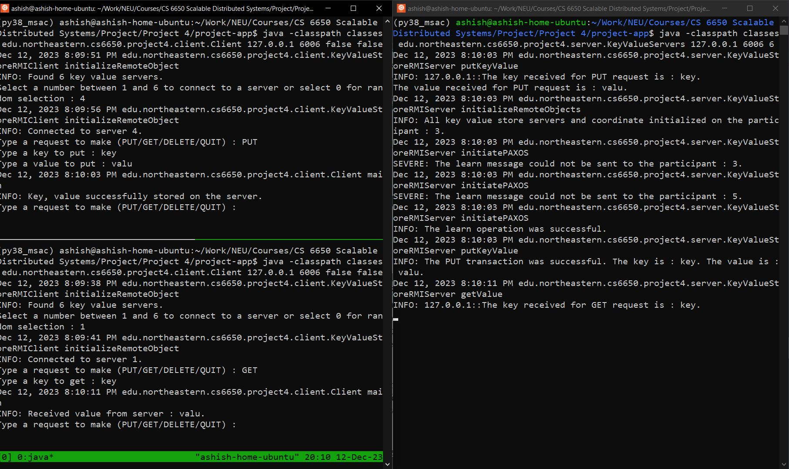

### CS 6650 Project 4

This project contains the implementation of RMI servers and a RMI client that perform Key-Value store operation using RMI. There is one RMI servers and are described below. This project was developed as a part of the CS 6650 Scalable Dist Systems course at the Northeastern University.

- `KeyValueStoreRMIServer` : Class that implements an RMI server for key value storage.  Additionally, this class implements the PAXOS algorithm and functionalities of different roles in the algorithm, viz. Proposers, Acceptors, and Learners

#### Compiling the project

Compilation of all the classes written in this project is required before running the application. To compile all the classes in this project, please run the following commands.
```bash
cd project-app
rm -rf classes
javac -d classes @sources.txt
```

#### Running the project

After the compilation step is performed, the server and the client applications can be started in any order. However, if the client application is started before the server application, the RMI call will fail. 

To start the server, run the following command. All arguments are required. 

```bash
cd project-app
java -classpath classes edu.northeastern.cs6650.project2.server.Server <server ip address> <server port> <number of partipants>
```

Required command line arguments:

1. IP address of the server. It could be 127.0.0.1 only when the server and client applications are running on the same computer. When the clients and servers are remote, use the IP address of the server on the same network as the client.
2. Port number on the server that will be used by the servers as the base port. The given port number is used by the Coordinator server registry. Additionally, more ports are used by the registry of the participants as explained below.
3. Total number of participants that are created by the Server application. Each participant creates a registry server.

To start the server, run the following command. The first and second arguments are required. The third and the fourth arguments are optional. 

```bash
cd project-app
java -classpath classes edu.northeastern.cs6650.project2.client.Client <server ip address> <server port> <true/false> <true/false>
```
Required command line arguments:

1. IP address of the server. It could be 127.0.0.1 only when the server and client applications are running on the same computer. When the clients and servers are remote, use the IP address of the server on the same network as the client.
2. Base port number of the server used during initialization of the server. _Selection of a particpant is done during execution_.

Optional command line arguments:

3. true/false - The third argument when set to false will not prepopulate the server with data. Default behavior is that the client prepopulates the server with data.
4. true/false - The fourth argument when set to false will not run the required 5 operations. Default behavior is that the client run the default 5 operations.

#### Test run

Below is a screenshot of a test performed on the application using a server running 6 replicas and three different clients. On the left hand two client programs are running in two different terminals, one on the top left performs a PUT operation and the one of the bottom left performs a GET operation using different replicas. The right terminal is running the server program.



